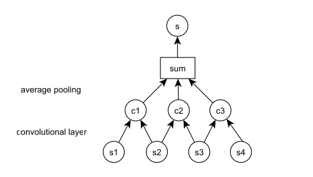

# Repo for Q-A and Answer triggering systems
This repository contains experiments on the [WikiQA](https://www.microsoft.com/en-us/research/publication/wikiqa-a-challenge-dataset-for-open-domain-question-answering/) dataset
mainly for investigating answer triggering - finding the relevant answer out of
a set of given answers to a question.

The base CNN implementation is from [Deep learning for answer sentence selection](https://arxiv.org/pdf/1412.1632.pdf).
The logic of using CNN for Sentence selection using word vectors is inspired
from [Yoon Kim's - CNN for Sentence Classification](http://www.aclweb.org/anthology/D14-1181)
The dataset is read from data/ folder and currently hardcoded in the last-line of the text.
Uses keras for CNN.

## Model

The current implementation maps the question and answer vectors into a higher
dimension using CNN and compares them using dot product or a fully connected
layer.

**CNN statistics**

|Parameter|Value|
|---------|-----|
|Filter Size|2,3,4|
|Convolution|Levels|1|
|Word vector|dimensions|300|
|Dense Layer|Dimensions|100|

The output of CNN is connected to a Logistic Layer which classifies the answer
to the question as relevant(**1**) or non-relevant(**0**)

## Tweaks

Because the dataset is highly skewed( One true answer to 5-6 false answers to a
question ), RandomOversampling is done to balance the set.
